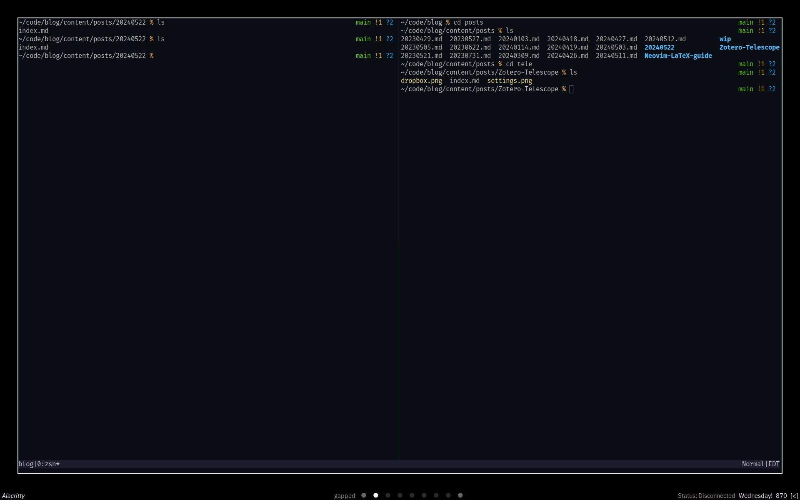
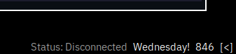
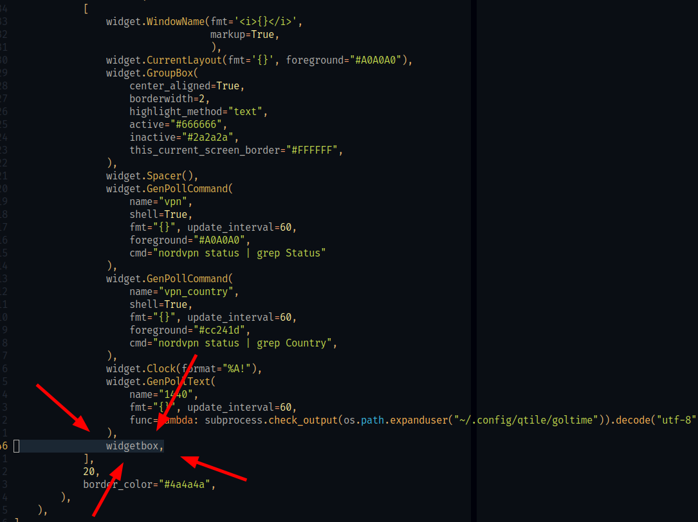

*I will most likely make a video on this, so for those who read the blog consider this an early-access version ;)*

# Introduction
I don't know if this sounds extreme or not, but personally having a clock in my line of vision at all times while studying kills productivity. I don't know if others feel the same, but personally if I have a clock and the date near by I won't stop thinking about it. It boils down to my OCD and letting the numbers take control in my head, so I will briefly explain my thought process and the steps I take.

Before I go any further, here's a screenshot of my workspace right now:



Pretty plain, right? That's intentional.

# Obsession with numbers
## OCD (Obsessive Compulsive Disorder)
I have an obsession with numbers. People who have OCD can experience it in many different ways. Most commonly, it's a separation between physical compulsions and mental compulsions. I "unfortunately" have both of them. Not to any extreme extent (at least I think I don't LOL) but it still affects me. One of the ways this manifests is through time

## Time & Dates
Time and dates really mess me up, and I mean REALLY mess me up. When I look at a clock while I know I have a deadline, I start focusing on the minutes. I calculate in my head how many minutes I have left before the next hour, and what the next hour means. I then count the hours and remember if there's anything I want to do in the day. If I don't meet this arbitrary goal/rule in my head for managing my time then it feels like the world is falling apart. I start compulsively checking the time, and checking my calendar. I start counting to see if I have enough time for anything, if there's enough days to do something.

## Counting
Counting is another big problem of mine. It took me 20 years of living until I realized I had a counting problem. Before it was more of a "haha look at me this is so quirky" but then later turned into "oh shit this is a problem". I count how many times I hit a button to make sure it's right in my head. I sometimes count (not to the extent I used to) how many steps I would take to get from one place to another. I wouldn't count the total steps though. It would be more like an army general counting **ONE TWO THREE FOUR, ONE TWO THREE FOUR!**. I count the time signature of songs I find interesting. Whenever I fidget with my fidget cube, I count how many times I hit one thing over another. Everything has a note to it in my head, so I have to play the song that's being matched in my head. But things have to end correctly or else I compulsively continue until it feels right. When I eat snacks, it has to be a certain way or else I won't stop eating. This obviously developed into a binge-eating disorder of some sorts, which further contributes to my unhealthy relationship with food (but that's a story for another time).

As you can already tell, this makes living really exhausting, and this is just scratching the surface. Counting, time, and relating the two creates many problems in my life. It's ruined study sessions plenty of times. So I made the executive decision to remove all clocks from my study area.

# Bye-bye clocks
_Before I get any comments mentioning this; yes, I still wear a watch. I don't obsessively check my watch for the time. It's something I just like having on at this point. This is the only clock that I use, and my relationship with it is healthy atm so it isn't an issue. If it becomes an issue, I'll sort it out and make an update._

This whole system I've worked out is to mitigate the urge to check the time and date, and the only way to do that is to give myself as little reason as possible to do so. This is the system I've worked out.

Let's refer back to the screenshot at the start of the article. As you may have notices, there are no times anywhere, but there's something in my bottom-right corner.



## 1440
This is a "widget" I made that's inspired by the MacOS application [1440](https://1440app.com). This acts as a countdown for the day by the minute. There are 1440 minutes in a day, and the widget refreshes with every minute passing. I made my own version of this called [goltime](https://github.com/tokisuno/goltime) that I run in my Qtile ``config.py`` using the following:
```python
widget.GenPollText(
    name="1440",
    fmt="{}", update_interval=60,
    func=lambda: subprocess.check_output(os.path.expanduser("~/.config/qtile/goltime")).decode("utf-8")
),
```
The reasoning behind this is simple: I associate time passing in increments of 60. I can't do that easily when counting down from 1440. Instead I am thinking of increments of 50-100 instead of 30-60. It also helps remind me really how much time we have in any given day. Since I use pomodoros, it's easy for me to keep track of what time it is if I use a 1hr time and trust that the 1hr time will go off. I already have a hard time eating, so this serves as a reminder to eat and drink water, without actually letting all the time pass by.

## Weekday
More often than not if I need to check the date for something, it's because I don't remember what day of the week it is. I normally remember things by the weekday instead of the actual numerical date. If I do happen to remember the numerical date, then I check my watch to look at the date. There's no reason for me to always look at the date since that's served as a distraction for me, so I've hidden them. Instead, I have this line in my Qtile config which just gives me the day of the week. That's all.

```python
    widget.Clock(format="%A!")
```
## Toggle clock
I still want to have a clock on my taskbar, but I like keeping it hidden along with my other widgets. I get distracted by the widgets on my taskbar, their ordering, and what they do. Before you say anything, yes, I know. I have many problems and should seek more therapy. LMFAO.

In Qtile you can create "widgetboxes" to store widgets inside, and you can toggle their visibility. Here's the code that does that:

_This is placed between my imports and keymaps_
```python
widgetbox = widget.WidgetBox(widgets=[
        widget.Systray(),
        widget.Clock(format="%Y-%m-%d | %H:%M")],
                             text_closed="[<]",
                             text_open="[>]")
```
_This is placed where I keep my keymaps_
```python
    Key([mod], "y",
        lazy.widget["widgetbox"].toggle()),
```
_This is called with all the other widgets_


# Conclusion
I think the main takeaway from this is I really like numbers, but also really enjoying having my time to focus and do things that I want to do. I am actively seeking solutions to problems that I encounter in my daily life, and that isn't going to change until the day I die. I want to be the change that I make in my own life, and maybe others will find some sort of value in what I do. There's no shame in failure or not being where you want to be in life. You have your entire life to figure that out and solve your own problems :)
