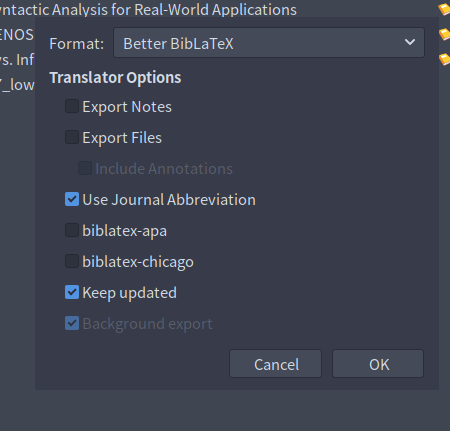
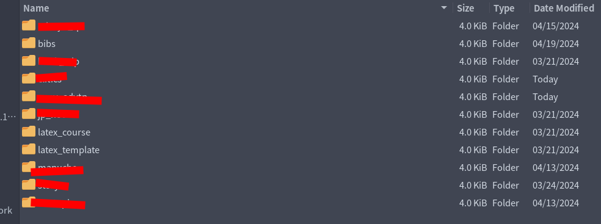

# Preface
This isn't an in-depth guide on how to use Neovim + LaTeX with Zotero integration. This is my explanation of how I set it up, how I sync my citations, and so-on. I will be writing a more in-depth guide in the future regarding this, but that post will come in due time.

# Introduction
Zotero is really sick. I love Zotero. If there's anything that I can attribute to making my academic life easier, it's Zotero. Zotero is a personal library/bibliography management program that allows you to add and sort the articles you've read, add proper metadata to them, and sort them. It makes citation creation infinitely easier -- something that I absolutely **DREADED** in public schooling. No longer are the days where I have to use ezbib or citationmachine to create a bibliography. With Zotero + LaTeX, that's all done for me!

## Demonstration
[CLICK HERE FOR DEMONSTRATION](https://youtu.be/e56fTq1yFJw)

## Requirements
* Neovim
* Unix operating system (I don't know how to use this with Windows)
* Some free time :)

# Tutorial
## Exporting citations
Without citations, Telescope would have nothing to source! That's why I believe this to be an important first step.

First, open your web-browser and search for the "Better BibLaTeX Zotero extension. This is what you're going to use to create your bibliographies. Add it to your Zotero and do what the installation process has you to do and voila, you have the extension. Now it's actually time to start exporting citations.

If you use Zotero and already sort your collections into folders, you're ahead of the game and I love you. For those who don't, you're a mess (/s).



1. Right click on the collection you want to export and select this new options called "Export collection..."
2. Change the format to "Better BibLaTeX"
3. Make sure the following options are checked off. This will create a new citation every time you add something to Zotero, and sync them in the background while you're working.
    * Use Journal Abbreviation
    * **Keep updated**
    * Background export

4. Pick a spot to save your citations
    * I normally put these in my Dropbox. My Dropbox is synced between my Laptop and Desktop, so whenever I'm out I can still access all my work and citations. I also keep my bibliographies in my ``../latex`` folder to simplify the process of sourcing them when I work later. I will explain this later.
5. Save them!

You've now successfully created an generated .bib file which Zotero automatically updates. Please keep in mind that updates citation keys will **NOT** be synced across files, so if there are keys you need to fix or update, I'd do that before you start using that citation in your projects. Aside from that, all of your metadata and author information is accessed when the document is compiled, so those stay in sync :)



## Sourcing citations with Telescope
Now here's the interesting part: accessing these with ``Telescope.nvim``. The plugin I use for this is called [telescope-bibtex.nvim](https://github.com/nvim-telescope/telescope-bibtex.nvim) and serves as an extension to Telescope. I couldn't figure out how to configure this for a long time, but after some trial and error I got it set up and working, and I'm very happy with it!
* I organize all my plugins in separate files using Lazy [(link to my nvim config)](https://github.com/tokisuno/nvim/tree/main/lua/lucas/lazy).

**Don't follow this guide to install Telescope**. I most likely won't be updating this all the time, and the installation/dependencies could change which could make this guide broken.

The first step would be to (obviously) install Telescope as follows.
```lua
return {
  {"nvim-telescope/telescope.nvim",
    dependencies = {
      "nvim-telescope/telescope-bibtex.nvim",
      'nvim-lua/plenary.nvim',
    },
-- ...
```
In this, we load our telescope-bibtex extension as a dependency for Telescope. This is to install it alongside Telescope while also loading it when it's being used. Now all we have to do is source our bibliographies.
```lua
opts = {
     extensions = {
       bibtex = {
         depth = 1,
         custom_formats = {
           {
             id = "zettel", cite_marker = "#%s"
           }
         },
         format = 'zettel',
         global_files = {
           "~/Dropbox/latex/bibs/clitics.bib",
           "~/Dropbox/latex/bibs/syntax.bib",
           "~/Dropbox/latex/bibs/philosophy.bib",
           "~/Dropbox/latex/bibs/programming.bib",
         },
         citation_max_auth = 2,
         context = false,
         context_fallback = true,
         wrap = false,
       },
     }
   },
   config = function (_, opts)
     require("telescope").setup(opts)
     require("telescope").load_extension("bibtex")
   end
 },
```

This also defines a custom format that I use when writing in my Zettelkasten. Also pay attention to this line:
```lua
format = 'zettel',
```
I am using this in order to force my custom Zettelkasten format. I was mainly using this for quick Zettelkasten citations, but this format can be changed to match the filetype or anything. Once again, [here's the repo which contains a guide on what the opts do](https://github.com/nvim-telescope/telescope-bibtex.nvim). I highly suggest skimming through this if you want to further understand what it is this config does.

## Keymaps
The last thing we have to do is create keymaps to actually use the plugin. Although we could run the command in our nvim command mode *every single time we want to use it*, that's exhausting. Let's save some energy. I manage **majority** of my binds using [which-key.nvim](https://github.com/folke/which-key.nvim) -- an nvim plugin made by folke (the goat). With this, I have a visual menu pop up every time I linger on a keybind for too long that shows me what my binds do. Each bind I use has a description that I wrote so if I get lost, it makes it really easy to remember what it is I want to do. Before using ``which-key``, I would make new binds without using them because I'd forget and be too lazy to go back to my config to remember what it was I wrote. ``which-key`` solves that entirely!

I only have one bind for citations which goes as follows.
```lua
-- ...
f = {
  z = {":Telescope bibtex<CR>", "Find Zotero Citation", opts},
},
-- ...
```
This is based off the mnemonic (f)ind (z)ettel. Although it doesn't really apply since you aren't finding a zettel, it has made sense in my head before and I'm used to it so I don't bother changing it.

# Conclusion
This is how I make my life as easy as possible when it comes to managing and exporting citations into papers I have due. This has saved me a lot of time and stress and headache, and I cannot recommend Zotero enough. Neovim is cool too ig.
